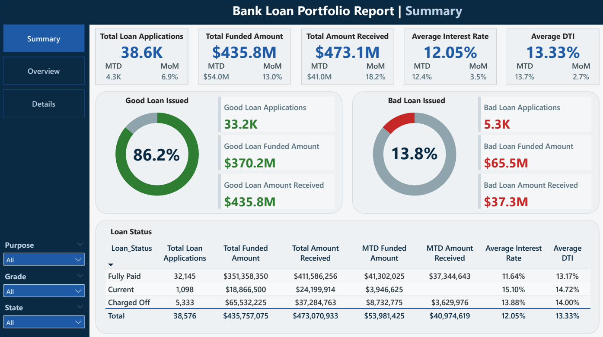
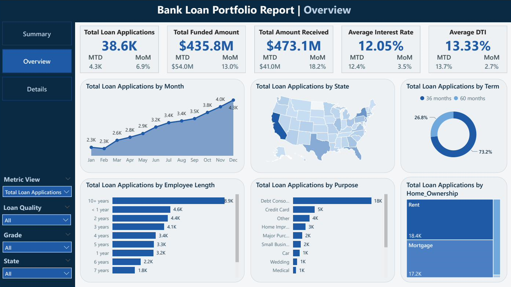
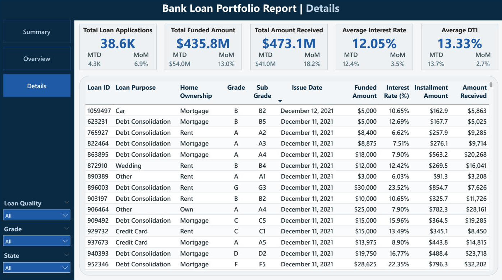

# Bank Loan Portfolio Analysis — SQL + Power BI


A full end-to-end data analytics project analyzing a bank's consumer loan portfolio using **MySQL** for KPI validation and **Power BI** for interactive dashboard reporting. The project covers 38,576 loan records and delivers three dashboards: Summary, Overview, and Details.

---

## Dashboard Screenshots

### Dashboard 1 - Summary
> Executive KPIs · Good vs Bad Loan Analysis · Loan Status Grid



---

### Dashboard 2 - Overview
> Monthly Trends · Regional Map · Loan Purpose · Term Split · Employment Length · Home Ownership



---

### Dashboard 3 - Details
> Loan-level drill-through grid with filters by Grade, State, and Loan Quality



---

## Project Structure

```
bank-loan-analysis/
│
├── README.md
├── bank_loan_report.pbix             # Power BI report file
├── bank_loan.csv                     # Raw dataset (38,576 records)
│
├── assets/
│   ├── summary_dashboard.png
│   ├── overview_dashboard.png
│   └── details_dashboard.png
│
├── docs/
│   ├── bank_loan-domain_knowledge.pdf
│   └── bank_loan-key_terminologies.pdf
│
├── 00_master_bank_loan_analysis.sql     # Master script - full KPI logic & documentation
├── 01_database_setup.sql                # DB + table creation
├── 02_data_ingestion.sql                # CSV load with date format handling
├── 03_kpi_summary.sql                   # Executive KPI queries (5 KPI groups)
├── 04_kpi_good_bad_loans.sql            # Good vs Bad loan analysis
├── 05_kpi_loan_status_grid.sql          # Loan status grid view
└── 06_overview_dashboard.sql            # Overview dashboard aggregations
```

---

## Dataset Overview

| Column | Type | Description |
|--------|------|-------------|
| `id` | INT | Unique loan identifier |
| `loan_status` | VARCHAR | Current / Fully Paid / Charged Off |
| `loan_amount` | DECIMAL | Principal disbursed |
| `int_rate` | DECIMAL(5,4) | Annual interest rate (stored as decimal e.g. 0.1205) |
| `dti` | DECIMAL | Debt-to-Income ratio |
| `issue_date` | DATE | Loan origination date |
| `last_payment_date` | DATE | Most recent payment received |
| `grade / sub_grade` | CHAR | Risk classification A-G / A1-G5 |
| `purpose` | VARCHAR | Borrower's stated loan purpose |
| `emp_length` | VARCHAR | Employment duration |
| `home_ownership` | VARCHAR | Own / Rent / Mortgage |
| `annual_income` | DECIMAL | Borrower's yearly income |
| `total_payment` | DECIMAL | Total cash received from borrower |

> **38,576 rows · 24 columns · Full year 2021**

---

##  Problem Statement

The bank needed a reliable reporting framework to:
- Monitor **loan application volume** and **funding trends** month over month
- Segment the portfolio into **Good Loans** (Current + Fully Paid) vs **Bad Loans** (Charged Off)
- Track **KPIs with MTD and MoM comparisons** for executive reporting
- Deliver an **interactive overview** across regions, purposes, terms, and borrower profiles

---

##  KPIs Tracked

### Summary Dashboard
| KPI | Total | MTD (Dec 2021) | MoM |
|-----|-------|----------------|-----|
| Total Loan Applications | 38,576 | 4,314 | ↑ 6.9% |
| Total Funded Amount | $435.8M | $54.0M | ↑ 13.0% |
| Total Amount Received | $473.1M | $41.0M | ↑ 18.2% |
| Avg Interest Rate | 12.05% | 12.4% | ↑ 3.5% |
| Avg DTI | 13.33% | 13.7% | ↑ 2.7% |

### Good Loan vs Bad Loan
| Metric | Good Loan | Bad Loan |
|--------|-----------|----------|
| % of Applications | **86.2%** | 13.8% |
| Applications | 33,243 | 5,333 |
| Funded Amount | $370.2M | $65.5M |
| Amount Received | $435.8M | $37.3M |

### Loan Status Grid
| Status | Applications | Funded | Received | Avg Rate | Avg DTI |
|--------|-------------|--------|----------|----------|---------|
| Fully Paid | 32,145 | $351.4M | $411.6M | 11.64% | 13.17% |
| Current | 1,098 | $18.9M | $24.2M | 15.10% | 14.72% |
| Charged Off | 5,333 | $65.5M | $37.3M | 13.88% | 14.00% |
| **Total** | **38,576** | **$435.8M** | **$473.1M** | **12.05%** | **13.33%** |

---

##  Overview Dashboard — Charts

| Chart Type | Dimension | Key Insight |
|------------|-----------|-------------|
| Line Chart | Monthly Trend | Loan volume grew steadily Jan → Dec 2021, peaking at 4,314 in December |
| Filled Map | By State | CA, TX, NY are the highest-volume lending regions |
| Donut Chart | Loan Term | 73.2% prefer 36-month loans over 60-month |
| Bar Chart | Employment Length | 10+ year employees lead with 8,900 applications |
| Bar Chart | Loan Purpose | Debt consolidation dominates at ~18K applications (~47%) |
| Tree Map | Home Ownership | Renters (18.4K) slightly outnumber Mortgage holders (17.2K) |

---

##  SQL Design Decisions

### Critical Date Logic
```
Funded Amount metrics   →  filtered on issue_date         (loan origination)
Amount Received metrics →  filtered on last_payment_date  (cash inflow)
MTD                     →  December 2021  (latest full month in dataset)
PMTD                    →  November 2021  (used only for MoM calculation)
```

### MoM Growth Pattern (used across all 5 KPIs)
```sql
SELECT
    ROUND(
        ((mtd_val - pmtd_val) / NULLIF(pmtd_val, 0)) * 100,
        2
    ) AS mom_growth_pct
FROM (
    SELECT
        SUM(CASE WHEN issue_date BETWEEN '2021-12-01' AND '2021-12-31'
            THEN loan_amount END) AS mtd_val,
        SUM(CASE WHEN issue_date BETWEEN '2021-11-01' AND '2021-11-30'
            THEN loan_amount END) AS pmtd_val
    FROM bank_loan_data
) t;
```

### Good vs Bad Loan Classification
```sql
-- Good Loan = Fully Paid + Current
WHERE loan_status IN ('Fully Paid', 'Current')

-- Bad Loan = Charged Off
WHERE loan_status = 'Charged Off'
```

### Data Ingestion - Date Parsing
```sql
-- Handles DD-MM-YYYY format and empty string nulls safely
SET issue_date = STR_TO_DATE(NULLIF(@issue_date, ''), '%d-%m-%Y')
```

---

##  How to Run

### Prerequisites
- MySQL Server 8.0
- MySQL Workbench or any SQL client
- Power BI Desktop (May 2024 or later)

### Step 1 - Database Setup
```sql
-- Run scripts in order:
source 01_database_setup.sql
```

### Step 2 - Data Ingestion
```sql
-- Update the CSV path to your local MySQL upload directory first
source 02_data_ingestion.sql
```
> Default path: `C:/ProgramData/MySQL/MySQL Server 8.0/Uploads/bank_loan.csv`  
> Update the `LOAD DATA INFILE` path in `02_data_ingestion.sql` to match your system.

### Step 3 - Run KPI Queries
```sql
source 03_kpi_summary.sql
source 04_kpi_good_bad_loans.sql
source 05_kpi_loan_status_grid.sql
source 06_overview_dashboard.sql
```

### Step 4 - Power BI
1. Open Power BI Desktop
2. Get Data → MySQL Database
3. Connect to `bankloan_db` and load `bank_loan_data`
4. Build KPI cards, charts, and grids using the validated SQL logic as reference

---

##  Tech Stack

| Tool | Version | Purpose |
|------|---------|---------|
| MySQL | 8.0 | Database setup, data ingestion, KPI validation, query execution |
| Power BI Desktop | May 2024 | Interactive dashboards, DAX measures |
| MS Excel | 2021 | Data exploration and cross-validation |

---

##  Key Findings

- **86.2% of the portfolio is healthy** — well within typical industry benchmarks for consumer lending
- **Charged-off loans returned only 56.9% of funded capital** — $37.3M received against $65.5M issued
- **Debt consolidation dominates** — nearly 47% of all applications, reflecting borrowers managing existing debt
- **73.2% prefer 36-month terms** — strong preference for shorter repayment periods over 60-month loans
- **10+ year employees are the most active borrowers** — accounting for 8,900 applications, more than any other group
- **Consistent growth throughout 2021** — loan volume peaked in December at 4,314 applications (↑ 6.9% MoM)
- **Current loans carry the highest interest rate (15.1%)** — higher than both fully paid (11.64%) and charged-off loans (13.88%)

---

##  License

This project is for educational and portfolio purposes.
